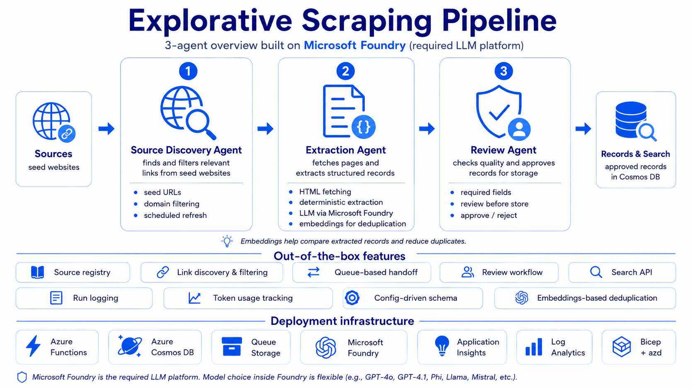
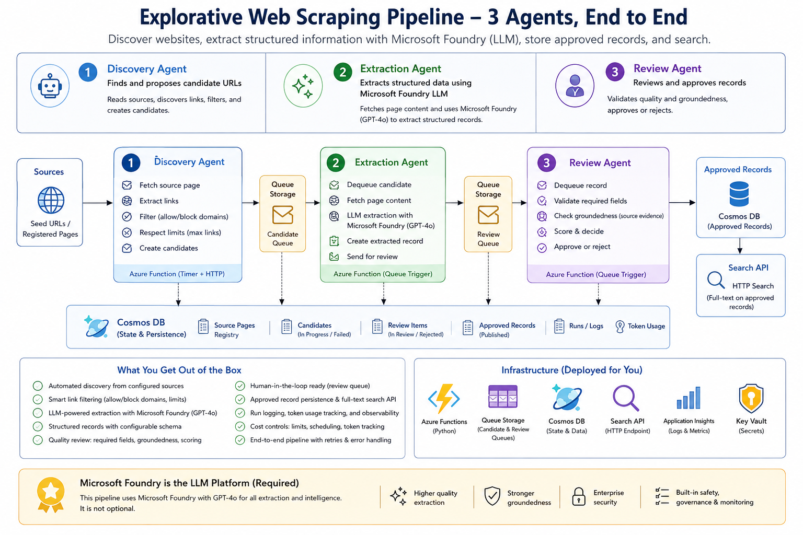

# Explorative Scraping Pipeline

Open-source Azure Functions pipeline for discovering, extracting, reviewing, and storing structured records from public web sources.

The project is a configurable version of an explorative scraping backend: bring your own domain schema, source URLs, prompts, and Azure resources.



The diagrams show the full model-enabled pipeline. The implementation uses Azure Functions and Cosmos DB containers for state and handoff; the default deployment does not require a separate Azure Queue Storage resource. Microsoft Foundry / Azure OpenAI deployments are optional at runtime: deterministic extraction and groundedness work without model calls, while configured model deployments enable LLM extraction, embeddings, and LLM groundedness checks.

## What It Does

- Discovers candidate links from source pages.
- Extracts readable text from public URLs.
- Uses deterministic extraction by default and optional Azure OpenAI structured extraction.
- Reviews records against a configurable schema.
- Checks for duplicates by exact source identity and, when embeddings are configured, provider-neutral vector similarity.
- Evaluates groundedness against the fetched source text and stores the score, result, reason, and threshold on approved records.
- Stores candidates, review items, approved records, source pages, run logs, and token usage in Azure Cosmos DB.
- Exposes HTTP endpoints for manual extraction, source screening, and searching stored records.
- Deploys to Azure Functions with azd and Bicep.

## Architecture At A Glance

The pipeline is organized as three logical agents running inside one Azure Functions app:

1. **Discovery** reads configured seed pages, extracts links, applies allow/block domain rules, and writes candidates into the `CandidateQueue` Cosmos DB container.
2. **Extraction** is triggered by new candidate documents, fetches each candidate URL, extracts a structured record, and writes review items into the `ReviewQueue` Cosmos DB container.
3. **Review** is triggered by new review documents, validates required fields, checks duplicate signals, evaluates groundedness against the source text, and stores approved records in the `Records` Cosmos DB container.

The HTTP endpoints let you manually screen sources, extract a single URL, and search approved records. A timer function revisits source pages on a configurable schedule. Cosmos DB stores source registry state, queue documents, review decisions, approved records, run logs, and token usage.



For a deeper component-level view, see `docs/architecture.md`.

## Azure Components

Default deployment provisions:

- Azure Functions on Linux Flex Consumption.
- Azure Storage.
- Azure Cosmos DB for NoSQL.
- Cosmos DB vector search on the `Records` container for embedding-based duplicate detection.
- Azure AI Services resource for Microsoft Foundry / Azure OpenAI compatible deployments.
- Application Insights and Log Analytics.
- Function app settings wired to Cosmos DB and the Azure AI endpoint.

Model deployment is intentionally configurable: the template creates the Azure AI Services/Foundry-capable resource, then you choose deployment names and set `AZURE_OPENAI_DEPLOYMENT`, `AZURE_OPENAI_EMBEDDING_DEPLOYMENT`, and `AZURE_OPENAI_GROUNDEDNESS_DEPLOYMENT` as needed. Deterministic extraction and deterministic groundedness fallback work without model calls.

## Quick Start

### 1. Clone and install

```powershell
git clone https://github.com/flo7up/explorative-scraping-pipeline.git
cd explorative-scraping-pipeline
python -m venv .venv
./.venv/Scripts/python.exe -m pip install -r requirements.txt -r requirements-dev.txt
./.venv/Scripts/python.exe -m pytest
```

### 2. Configure the scraping domain

Edit `pipeline.config.json`:

- `domainDescription`: what kind of records you want to find
- `sourceDiscovery.seedUrls`: starting pages to explore
- `sourceDiscovery.allowedDomains`: optional domain allow-list
- `schema.fields`: the structured output fields

See `docs/use-cases.md` for examples, including an AIUseCaseHub-style use case pipeline.

### 3. Run locally

Run locally with Azure Functions Core Tools:

```powershell
Copy-Item local.settings.sample.json local.settings.json
func start
```

## Deploy To Azure

[](https://portal.azure.com/#create/Microsoft.Template/uri/https%3A%2F%2Fraw.githubusercontent.com%2Fflo7up%2Fexplorative-scraping-pipeline%2Fmain%2Finfra%2Fmain.json)

The button deploys the generated ARM template in `infra/main.json`. It provisions:

- Azure Functions on Linux Flex Consumption.
- Azure Storage, including the Flex deployment package container.
- Azure Cosmos DB for NoSQL with database and pipeline containers.
- Cosmos DB vector search on the `Records` container for embedding-based duplicate detection.
- Azure AI Services resource for Microsoft Foundry / Azure OpenAI compatible deployments.
- Application Insights and Log Analytics.
- Function app settings wired to Cosmos DB, Storage, Application Insights, and the Azure AI endpoint.

The one-click button provisions resources and app settings. Use `azd up`, GitHub Actions, or Functions Core Tools when you also want to publish the Function App code.

### Recommended: Azure Developer CLI

```powershell
azd auth login
azd up
```

After deployment, configure the model deployments you want to use:

1. Open the provisioned Azure AI Services resource in Microsoft Foundry.
2. Deploy a chat model and set `AZURE_OPENAI_DEPLOYMENT` for structured extraction.
3. Deploy an embedding model and set `AZURE_OPENAI_EMBEDDING_DEPLOYMENT` for vector duplicate detection.
4. Optionally set `AZURE_OPENAI_GROUNDEDNESS_DEPLOYMENT` for LLM groundedness checks; otherwise the pipeline uses deterministic token-overlap groundedness.
5. Keep `llm.maxInputChars` and `groundedness.maxInputChars` conservative until you understand token usage.

### GitHub Actions

The repo includes `.github/workflows/deploy.yml`. Configure these repository variables or secrets:

- `AZURE_CLIENT_ID`
- `AZURE_TENANT_ID`
- `AZURE_SUBSCRIPTION_ID`
- `AZURE_ENV_NAME`
- `AZURE_LOCATION`

The workflow uses OIDC and does not require publish profiles.

## Example Use Cases

This repository can power different explorative scraping pipelines by changing config and prompts:

- AI use case discovery, like AIUseCaseHub.com.
- Real estate project discovery across developer portfolios, planning portals, construction news, and investment announcements.
- Customer case study discovery for a specific vendor ecosystem, including partners, products, industries, and outcomes.
- Sustainability project discovery from ESG reports, climate-tech announcements, and public project pages.
- Public sector digital-service examples from agency announcements, procurement pages, and modernization programs.
- Competitor launch monitoring across product pages, press releases, changelogs, and customer announcements.
- Grants, tenders, and funding opportunity monitoring from public portals and institutional websites.
- Research-to-product signal tracking across university labs, startup blogs, patents, and industry publications.

See `docs/use-cases.md` and `examples/`.

## Configuration

Copy `.env.example` to `local.settings.json` for local Functions development, or set matching app settings in Azure.

The pipeline behavior is controlled by `pipeline.config.json`:

- record type and domain description
- seed URLs and allowed domains
- output schema fields
- LLM deployment settings
- embedding and groundedness deployment settings
- quality gates, duplicate thresholds, and groundedness behavior

## Cost Controls

The default configuration is conservative:

- no model call is required for deterministic extraction
- no model call is required for deterministic groundedness fallback
- source text is truncated before model use
- source pages have revisit intervals
- candidate processing is queue based
- model calls are logged by function and deployment
- review-before-store can be enabled or disabled

The main baseline cost in the current template is Cosmos DB provisioned throughput: each pipeline container receives dedicated RU/s. Pipeline frequency then scales variable costs through source fetches, Function executions, Cosmos operations, telemetry ingestion, and optional model calls. See `docs/cost-controls.md` for formulas and example scenarios.

## One-Click Deploy Button

The portal button is already wired for `flo7up/explorative-scraping-pipeline`. If you fork this repo, update the raw GitHub URL in the README button to point to your fork's `infra/main.json`.

## Security

Do not commit secrets. Use Azure app settings, Key Vault, or GitHub Actions secrets. See `SECURITY.md`.

## License

MIT. See `LICENSE`.
