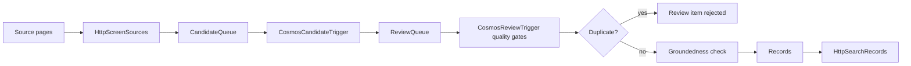

# Architecture

The pipeline is an Azure Functions app with queue-driven processing.

## Main Runtime Components

- `DiscoveryAgent` (`src/pipeline/agents/discovery_agent.py`): discovers candidate URLs from seed pages.
- `ExtractionAgent` (`src/pipeline/agents/extraction_agent.py`): fetches candidate URLs and extracts structured records.
- `ReviewAgent` (`src/pipeline/agents/review_agent.py`): validates extracted records, checks duplicate signals, evaluates groundedness, and stores approved output.
- `HttpScreenSources`: HTTP adapter for the discovery agent.
- `CosmosCandidateTrigger`: Cosmos DB trigger adapter for the extraction agent.
- `CosmosReviewTrigger`: Cosmos DB trigger adapter for the review agent.
- `HttpExtractUrl`: manual one-off extraction endpoint.
- `HttpSearchRecords`: simple read endpoint for approved records.
- `TimerSourceRefresh`: revisits due source pages.

## Storage

Cosmos DB containers are defined in `src/pipeline/cosmos.py`.

- `SourcePageRegistry`
- `CandidateQueue`
- `ReviewQueue`
- `Records`
- `PipelineRuns`
- `TokenUsage`

The `Records` container is deployed with a vector policy on `/embedding`. Approved records can store provider-neutral embeddings so the review stage can find semantically similar existing records with Cosmos DB `VectorDistance`.

## Quality Features

- Deduplication: exact normalized source URL/hash matches are treated as duplicates, and the intended review path creates provider-neutral embeddings with `AZURE_OPENAI_EMBEDDING_DEPLOYMENT` so it can search existing records by vector distance.
- Duplicate signals: vector similarity is combined with title similarity, organization overlap, content overlap, and technology overlap before a record is rejected as a duplicate.
- Groundedness: approved records are checked against the fetched source text with the configured `AZURE_OPENAI_GROUNDEDNESS_DEPLOYMENT`. Results are stored on the record and review item.

## Configuration

Domain behavior lives in `pipeline.config.json`, not code. Use it to change schema, seed sources, source filtering, and LLM behavior.
